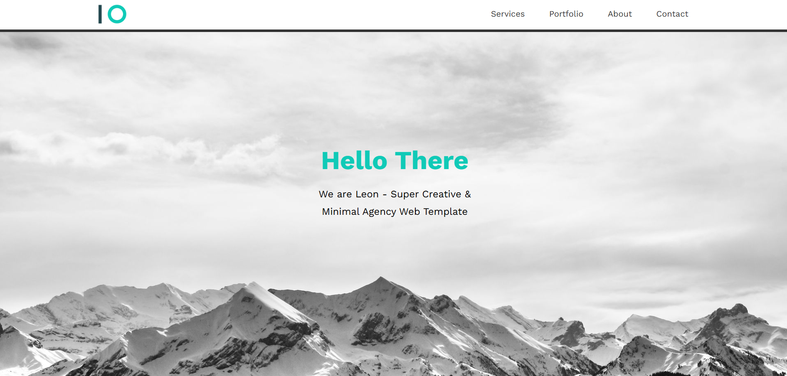

# Leon - HTML & CSS Template 🎨🖥️

<div align="center">

A clean, minimal agency landing page template built with pure HTML and CSS. Features a responsive layout, smooth scrolling, and a modern design with sections for services, portfolio, about, and contact.

<br>

<div align="center">
  <a href="https://tendopain18.github.io/html-css-template-leon/" target="_blank">
    
  </a>
</div>

<br>
<br>

[](https://tendopain18.github.io/html-css-template-leon/)

</div>

## 🎨 About The Project

Leon is a minimal and elegant agency website template. It showcases a clean design with a full-screen landing hero, feature highlights, services, a portfolio grid, an about section, and a contact area — all built with semantic HTML and custom CSS without any frameworks.

## ✨ Features

- **Responsive Navigation**: Fixed header with hamburger menu on mobile and a horizontal nav on desktop
- **Full-Screen Hero**: Landing section with a background image and centered intro text
- **Features Section**: Icon-based feature highlights in a responsive grid
- **Services Section**: Two-column service list with a decorative image column
- **Portfolio Grid**: Responsive card grid showcasing project images with titles and descriptions
- **About Section**: Image with decorative CSS borders and descriptive text columns
- **Contact Section**: Email link and social media icons
- **Smooth Scrolling**: CSS `scroll-behavior: smooth` for anchor navigation

## 🚀 Getting Started

1. **Clone the repository**
```bash
git clone https://github.com/TendoPain18/html-css-template-leon.git
```

2. **Open in browser**
```
Open index.html directly in any modern browser
```

No build tools or dependencies required.

## 🛠️ Built With

- **HTML5** — Semantic markup
- **CSS3** — Custom properties (CSS variables), Flexbox, CSS Grid, media queries
- **Font Awesome 6** — Icons
- **Google Fonts** — Work Sans typeface

## 📄 License

This project is licensed under the MIT License.

## 🙏 Acknowledgments

- Design inspired by [Elzero Web School](https://elzero.org)
- Icons by Font Awesome

<br>
<div align="center">
  <a href="https://tendopain18.github.io/html-css-template-leon/" target="_blank">
    
  </a>
</div>
<br>

## <!-- CONTACT -->
<div id="toc" align="center">
  <ul style="list-style: none">
    <summary>
      <h2 align="center">
        🚀
        CONTACT ME
        🚀
      </h2>
    </summary>
  </ul>
</div>
<table align="center" style="width: 100%; max-width: 600px;">
<tr>
  <td style="width: 20%; text-align: center;">
    <a href="https://www.linkedin.com/in/amr-ashraf-86457134a/" target="_blank">
      
    </a>
  </td>
  <td style="width: 20%; text-align: center;">
    <a href="https://github.com/TendoPain18" target="_blank">
      
    </a>
  </td>
  <td style="width: 20%; text-align: center;">
    <a href="mailto:amrgadalla01@gmail.com">
      
    </a>
  </td>
  <td style="width: 20%; text-align: center;">
    <a href="https://www.facebook.com/amr.ashraf.7311/" target="_blank">
      
    </a>
  </td>
  <td style="width: 20%; text-align: center;">
    <a href="https://wa.me/201019702121" target="_blank">
      
    </a>
  </td>
</tr>
</table>
<!-- END CONTACT -->
